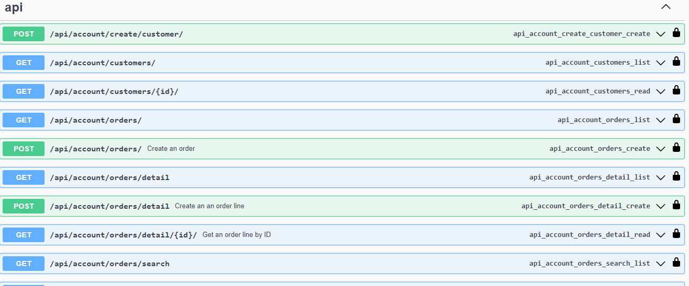
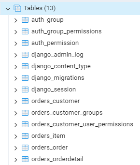
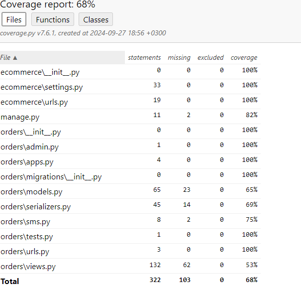

# Description

- a Django Rest Framework (DRF) project for managing customers and orders. The project is designed for simple understanding and extension, with an emphasis on creating RESTFUL APIs, Implementation of data structures, Implementation authentication and authorization, writing automated tests at all levels (unit, integration, and acceptance), and integrating CI/CD.

## Table of Contents

- [Project Overview](#project-overview)
- [Features](#features)
- [Technologies Used](#technologies-used)
- [Getting Started](#getting-started)
  - [Prerequisites](#prerequisites)
  - [Installation](#installation)
  - [Running the Application](#running-the-application)
- [Sections](#sections)
- [Screenshots](#screenshots)
- [API Endpoints](#api-endpoints)
- [Database](#database)
- [Deploying to AWS EC2](#Deploying-to-AWS-EC2)
- [Unit Testing](#unit-testing)
  - [Running Tests](#running-tests)
  - [Writing Tests](#writing-tests)
- [Coverage](#coverage)
  - [Measuring Coverage](#measuring-coverage)
  - [Improving Coverage](#improving-coverage)
- [Contributing](#contributing)
- [License](#license)
- [Contact](#contact)

## Project Overview

- A simple Django project that inputs/uploads customers, products and orders using REST API. Requires users to authenticate themselves using JWT. Africastalking sms gateway is implemented to add sms functionality.

## Features

- User authentication
- Customer management
- product management
- Order processing and management
- Swagger API UI
- Admin panel for managing groups

## Technologies Used

- Django
- Djngorestframework
- Postgresql
- drf-yasg
- JWT
- Africastalking
- coverage
- Terraform
- AWS

## Getting Started

### Prerequisites

- Python 3.x
- Django 4.x
- Postgresql
- djangorestframework
- africastalking
- coverage
- Terraform
- AWS
- JWT

### Installation

1. Clone the repository:
   ````sh
   https://github.com/MwangiSara/ecommerce.git```
   ````
2. Install Dependencies
   `pip install -r requirements.txt`
3. make sure you have postgresql
4. Run the Project
   `python manage.py migrate`
   `python manage.py runserver`
5. On Your browser enter `127.0.0.1:8000/developer/docs`

- **NB** when using aws use : http://98.82.180.186/developer/docs

## API Endpoints

- POST [http://127.0.0.1:8000/api/account/create/customer/](http://127.0.0.1:8000/api/account/create/customer/) - register as a customer
- POST [http://127.0.0.1:8000/auth/jwt/create/](http://127.0.0.1:8000/auth/jwt/create/)- Get access token
- POST [http://127.0.0.1:8000/auth/jwt/verify/](http://127.0.0.1:8000/auth/jwt/verify/) - verify access token
- POST [http://127.0.0.1:8000/api/order/products/](http://127.0.0.1:8000/api/order/products/)- Create an Item
- POST [http://127.0.0.1:8000/api/order/orders/](http://127.0.0.1:8000/api/order/orders/)- Create an order
- GET [http://127.0.0.1:8000/api/order/orders/detail](http://127.0.0.1:8000/api/order/orders/detail)- get order details
- GET [http://127.0.0.1:8000/api/order/search/](http://127.0.0.1:8000/api/order/search/)- search order with date

## Database



## Deploying to AWS EC2

- Deploying a API application on AWS EC2 involves several steps, including setting up the EC2 instance, configuring the environment, and deploying your API app.
- link

### Step 1: Set Up an AWS EC2 Instance

1. Launch an EC2 Instance:

   - Log in to your AWS Management Console.
   - Navigate to the EC2 Dashboard and click on “Launch Instance”.
   - Choose an Amazon Machine Image (AMI). The most commonly used one is the Amazon Linux 2 AMI.
   - Select an instance type (e.g., t2.micro for free tier).
   - Configure instance details, storage, and tags as needed.
   - Configure security groups to allow traffic on ports 22 (SSH), 80 (HTTP), and 443 (HTTPS) if you plan to use SSL.
   - Review and launch the instance, and download the key pair (.pem file) for SSH access.

2. Connect to Your EC2 Instance:
   - SSH into the instance and run these commands to update the software repository and install our dependencies.

```
ssh -i /path/to/your-key.pem ec2-user@your-ec2-instance-public-ip
```

### Step 2: Install Dependencies

1. Update Packages:

```
sudo apt update -y
sudo apt install python3-pip python3-dev git nginx -y
sudo pip3 install virtualenv
```

2. Clone the API server app.

```
cd /home/ubuntu
git clone https://github.com/MwangiSara/ecommerce.git
cd ecommerce
```

3. install poatgresql

```
sudo apt install postgresql postgresql-contrib -y
sudo systemctl start postgresql
sudo systemctl enable postgresql  # Enable it to start on boot
sudo -u postgres psql
CREATE DATABASE "Ordering";
CREATE USER postgres WITH PASSWORD 'root';
ALTER USER postgres PASSWORD 'root';
GRANT ALL PRIVILEGES ON DATABASE Ordering TO postgres;
\q
```

4. Set Up Virtual Environment

```
virtualenv env
source env/bin/activate

# Install Django and other dependencies
pip install -r requirements.txt
```

5. Apply Migrations

```
python manage.py migrate
python manage.py collectstatic --noinput
```

6. Install and Configure Gunicorn

- Gunicorn will serve as your application server between Django and Nginx.

```
pip install gunicorn
gunicorn --bind 0.0.0.0:8000 ecommerce.wsgi:application
```

7. Configure Nginx

```
sudo nano /etc/nginx/nginx.conf
```

- create a server block in the file

```
server {
    listen 80;
    server_name your-ec2-public-ip;
    location / {
        proxy_pass http://127.0.0.1:8000;
    }
}
```

- restart nginx

```
sudo systemctl restart nginx
sudo systemctl enable nginx
```

8. Configure Gunicorn as a Systemd Service

- Create a systemd service to run Gunicorn automatically on startup.

```
sudo nano /etc/systemd/system/gunicorn.service

```

- Add the following content:

```
[Unit]
Description=gunicorn daemon for Django REST API
After=network.target

[Service]
User=ubuntu
Group=nginx
WorkingDirectory=/home/ubuntu/ecommerce
ExecStart=/home/ubuntu/ecommerce/env/bin/gunicorn --workers 3 --bind unix:/home/ubuntu/ecommerce/gunicorn.sock your_project_name.wsgi:application

[Install]
WantedBy=multi-user.target
```

- Start and Enable Gunicorn Service:

```
sudo systemctl start gunicorn
sudo systemctl enable gunicorn
gunicorn --bind 127.0.0.1:8000 ecommerce.wsgi:application --log-file gunicorn.log
```

## Unit Testing

Here are some tests for this project and the steps

### Running test

run your test using `python manage.py test`

### Write the test

the tests are in test.py
Use Django `TestCase` module to create your own tests

## Coverage

To identify which parts of the code are not tested, thereby revealing untested areas that could potentially harbor bugs, use coverage software

### Measuring Coverage

- Install coverage `pip install coverage`
- run test using coverage `coverage run manage.py test`
- get report ``coverage report`
- Generate report in HTML `coverage html`
  

## Contributing

Contributions are welcome! Please open an issue or submit a pull request with any improvements or new features. Here are the Steps

1. Fork the repository
2. Create a new branch (git checkout -b feature-name)
3. Make your changes
4. Commit your changes (git commit -m 'Add new feature')
5. Push to the branch (git push origin feature-name)
6. Open a pull request

## License

This project is licensed under the MIT License.

## Contact

If you have any questions, feel free to reach out:

- Name: Sarah Mwangi
- Email: mwangisarah113@gmail.com
- GitHub: Mwangisara
